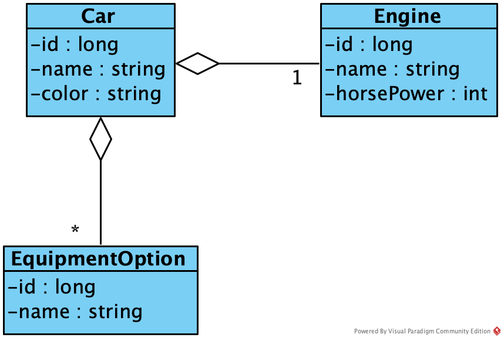
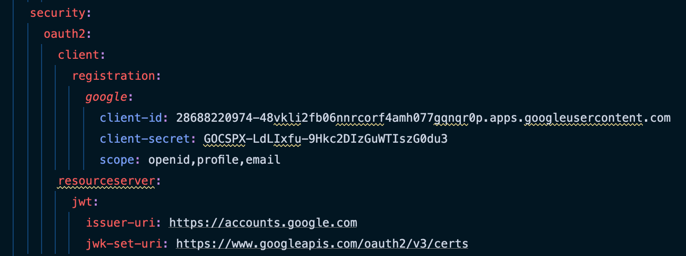
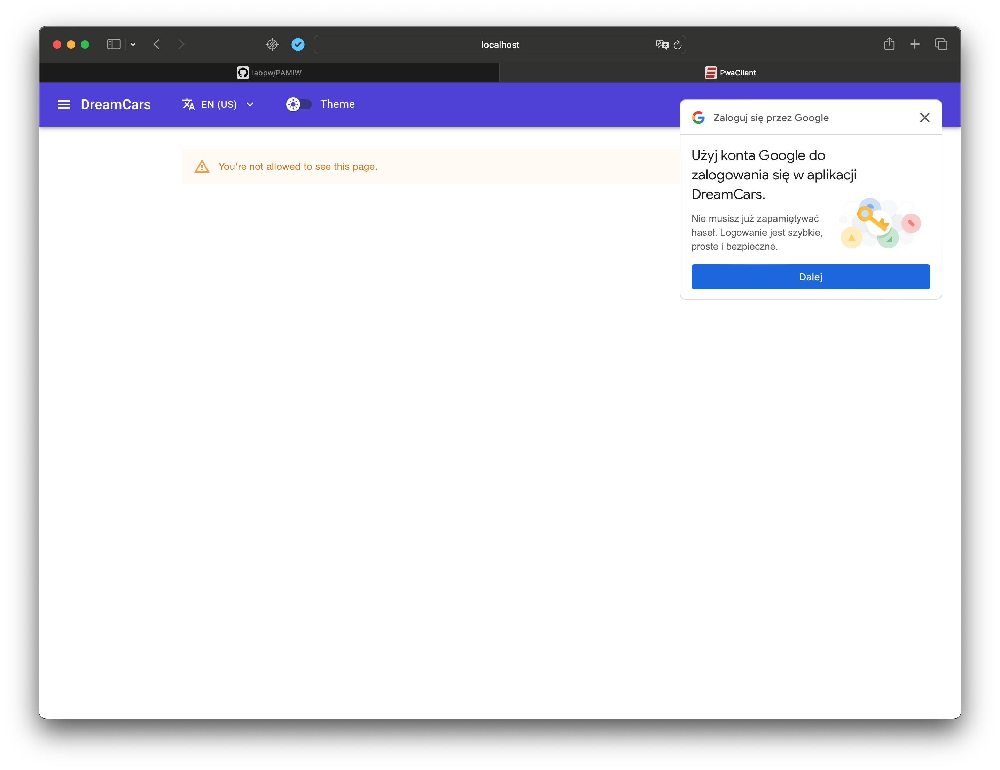
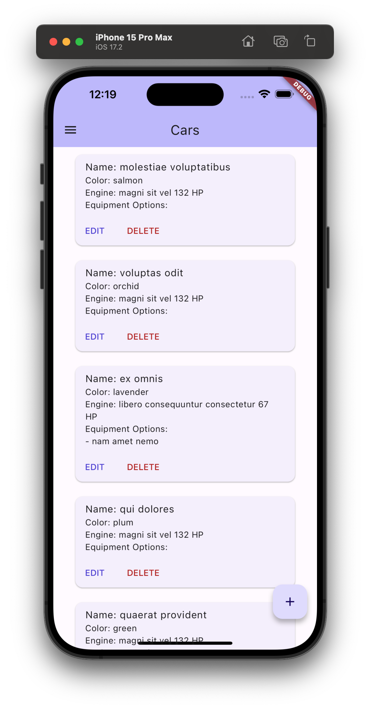

# Projekt z Programowania Aplikacji Mobilnych i Webowych

## Wstęp
W ramach projektu zostały rozwinięte wcześniej utworzone w ramach zadań laboratoryjnych aplikacje:
1. **API** - napisane za pomocą Spring Boot (Java) REST API.
2. **Klient PWA/WASM** - napisana za pomocą Blazor WASM (C#) progresywna aplikacja webowa korzystająca z mechanizmu WebAssembly.
3. **Klient mobilny** - napisana za pomocą Flutter (Dart) natywna aplikacja mobilna kompatybilna z systemami iOS i Android.
4. **Klient desktop (dodatkowo)** - napisana za pomocą JavaFX (Java) wieloplatformowa aplikacja desktopowa.

## Domena aplikacji
W celu zrealizowania zadań laboratoryjnych oraz projektu, została zaprojektowana prosta domena składająca się z 3 encji: Car, Engine oraz EquipmentOption. Stworzone aplikacje udostępniają funkcjonalność CRUD dla wymienionych encji.

## Zrealizowane zadania w ramach projektu

### API
#### Logowanie z Google (OAuth2)
W panelu Google Console został utworzony nowy projekt związany z realizowanym projektem. Skonfigurowano ekran zgody OAuth oraz utworzono dane klienta OAuth.

W pliku konfiguracyjnym aplikacji Spring Boot dodano odpowiednie wpisy z identyfikatorem oraz sekretem pozwalającymi na proces weryfikacji tokenów JWT wygenerowanych przez Google.

Konfiguracja Spring Security została zmodyfikowana tak, aby obsługiwać Google OAuth oraz traktować utworzone API jako serwer zasobów.

#### Hosting API na publicznym serwerze
API zostało przeniesione na hosting w chmurze Azure. W tym celu utworzona została maszyna wirtualna w usługach chmury Azure z systemem operacyjnym Ubuntu.

Na maszynie wirtualnej zainstalowano środowisko uruchomieniowe Java oraz silnik bazy danych Postgres. Skompilowane API zostało umieszczone w formie pliku JAR na maszynie wirtualnej. Następnie utworzono plik definiujący nową usługę, która uruchamia i zarządza wspomnianym plikiem JAR.

### Klient PWA/WASM

#### Udoskonalenie interfejsu aplikacji webowej
W celu udoskonalenia interfejsu aplikacji Blazor WASM została dodana biblioteka komponentów MudBlazor, która korzysta z systemu projektowego Google Material Design. Interfejs aplikacji został przeprojektowany tak, aby wspierać zasady dobrego projektowania UI/UX. Ponadto dodano walidację danych oraz animacje ładowania.

#### Ustawienia użytkownika
Dodano opcje zmiany języka aplikacji (polski i angielski) oraz zmiany schematu kolorystycznego między jasnym i ciemnym motywem. Ustawienia użytkownika zapisywane są w local storage, dzięki czemu są zapamiętywane po zamknięciu aplikacji.

##### Zmiana języka

##### Zmiana schematu kolorystycznego

#### Logowanie z Google

### Klient mobilny

#### Udoskonalenie interfejsu aplikacji mobilnej
W celu udoskonalenia interfejsu aplikacji mobilnej zastosowano widgety z Google Material Design w wersji 3 we frameworku Flutter. Interfejs aplikacji został przeprojektowany tak, aby wspierać zasady dobrego projektowania UI/UX. Ponadto dodano walidację danych oraz animacje ładowania.

#### Ustawienia użytkownika
Dodano opcje zmiany języka aplikacji (polski i angielski) oraz zmiany schematu kolorystycznego między jasnym i ciemnym motywem. Ustawienia użytkownika zapisywane są w preferencjach użytkownika, dzięki czemu są zapamiętywane po zamknięciu aplikacji.

##### Zmiana języka

##### Zmiana schematu kolorystycznego

#### Logowanie z Google

#### Dostęp do zasobów sprzętowych

Aplikacj mobilna korzysta z aparatu urządzenia mobilnego, w celu skanowania kodów QR posiadających informacje na temat samochodów, które następnie wyświetla po zeskanowaniu takiego kodu.

### Klient desktop (dodatkowo)
Dodatkowo dostosowano klienta desktop do nowego ekosystemu.

#### Udoskonalenie interfejsu aplikacji mobilnej
W celu udoskonalenia interfejsu aplikacji desktopowej zastosowano bibliotekę skórek AtlantaFX. Interfejs aplikacji został przeprojektowany tak, aby wspierać zasady dobrego projektowania UI/UX.

#### Ustawienia użytkownika
Dodano opcje zmiany języka aplikacji (polski i angielski) oraz zmiany schematu kolorystycznego między jasnym i ciemnym motywem. Ustawienia użytkownika zapisywane są w preferencjach użytkownika, dzięki czemu są zapamiętywane po zamknięciu aplikacji.

##### Zmiana języka

##### Zmiana schematu kolorystycznego

## Niezrealizowane zadania
*Wszystkie zadania postawione w ramach projektu zostały zrealizowane.*
